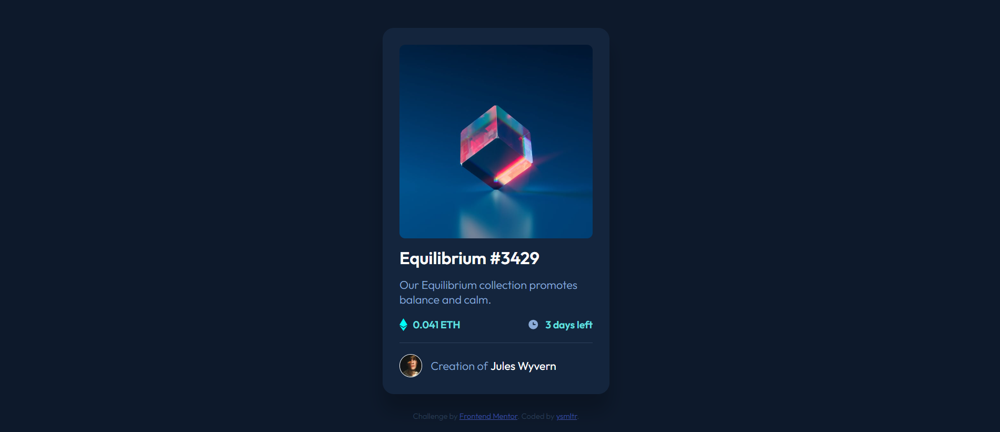

# Frontend Mentor - NFT preview card component solution
Welcome! 👋
Hello! Thanks for cheking out this repository.

What is it about
It's a solution of a newbie challange called "NFT Preview Card Component" made by Frontend Mentor.

Here is the link of the challange- https://www.frontendmentor.io/challenges/nft-preview-card-component-SbdUL_w0U 
### Screenshot

### Links

- Solution URL:(https://github.com/ysmltr/nft-preview-card-component-main)
- Live Site URL: [Add live site URL here](https://your-live-site-url.com)

## My process

### Built with

- Semantic HTML5 markup
- CSS custom properties
- Flexbox
- CSS Grid

### What I learned

Built with
-HTML

-CSS Flexbox

What I learned
How to make a responsive design with css flexbox and the basic uses of html and css. viewing your solution or for yourself when you look back on this project in the future.**

## Author

- Website - [yesim ilter](https://yesimilter.me)
- Frontend Mentor - [@ysmltr](https://www.frontendmentor.io/profile/ysmltr)
- Twitter - [@yesimltr](https://twitter.com/yesimltr)

